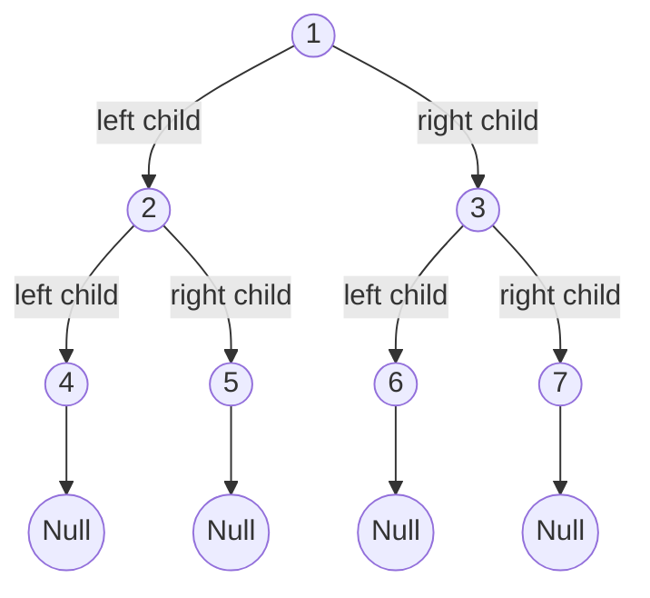
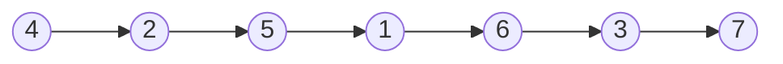
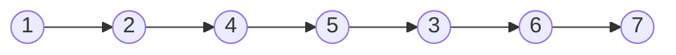
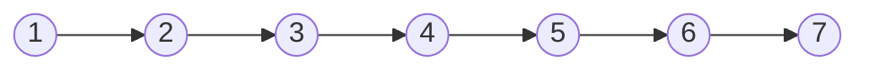
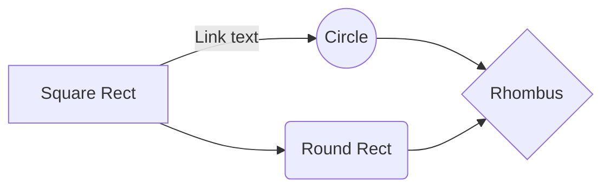

# Binary Tree

Each node in the binary tree must have at most 2 children.

## DFS
### In Order Traversal [Left, Root, Right]

### Pre Order Traversal [Root, Left, Right]

### Post Order Traversal [Left, Right, Root]

---

## BFS
### Level Order Traversal

---

